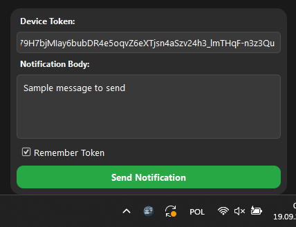
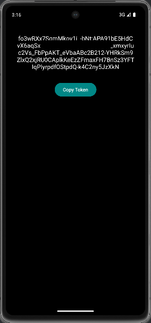

# DataTransfer - Notification Sender

Project consists of a desktop application for Windows (built with Python) and an Android mobile app (built with Java). Together, they allow you to send push notifications from your computer directly to a specific Android device using Google Firebase.

## Features
- Send push notifications from a Windows PC to a targeted Android device.
- Simple interface for sending messages using the Firebase Cloud Messaging (FCM) service.
- Ability to save and remember device tokens for easier message sending.
  
## Technologies Used
- **Python** with **PyQt5** for the desktop application.
- **Java** for the Android app.
- **Firebase Cloud Messaging (FCM)** for notification delivery.
- **Requests** library for handling HTTP requests.

## Screenshots
### Desktop Application

### Android Application


## Installation Instructions

### Desktop Application
1. [Download the .exe file](https://github.com/Antek-N/DataTransfer/releases/download/v1.0/main.exe).
2. Run the .exe file on your computer.
   - The program will appear as a tray icon in the Windows taskbar (it may be hidden under the expandable arrow).
3. Click the tray icon to open the message sending window.

### Android Application
1. [Download the .apk file](https://github.com/Antek-N/DataTransfer/releases/download/v1.0/app-release.apk).
2. Transfer the .apk file to your Android device (e.g., using a USB cable).
3. Install the .apk on your phone (you may need to enable "Install from unknown sources" in settings).
4. After installation, the app is ready to use.

## Usage Instructions

1. Open the app on your Android device and grant it permission to display notifications.
2. In the app, copy the device token (this may take a few moments to load).
3. Paste the token into the desktop application in the "Device Token" field (you can email the token to yourself for easy transfer between devices).
4. Enter your message in the "Notification Body" field and click **Send Notification** to deliver the notification to your Android device.
5. Optionally, you can use the "Remember Token" feature to avoid re-entering it in the future.
   - The token is unique for each installation and will only change if the app is reinstalled.

## Compilation Instructions (Optional)
If you'd like to modify the project or connect it to your own Firebase account, follow these steps:

### Firebase Setup:
1. Log in to [Google Firebase](https://firebase.google.com/) and create a new Firebase project.
2. In **Project Settings**, under the **General** tab, connect the project to your Android app:
   - Select Android as the platform and use `com.example.datatransfer` as the package name.
   - Download the `google-services.json` file and replace the existing file in `android_app/app/`.
3. In **Project Settings**, go to **Service Accounts** and generate a new private key for the Firebase Admin SDK.
   - Rename this file to `firebase_key.json` and replace the existing file in `computer_app/data/`.

### Compiling the Android App:
1. Open the `android_app` folder in Android Studio.
2. Build the APK from the **Build** menu.

### Compiling the Desktop App:
1. Install the required libraries using `pip install -r requirements.txt`.
2. Run the following command in the **computer_app** folder with the virtual environment activated, using **PyInstaller** to create the executable:
   ```bash
   pyinstaller --noconfirm --onefile --windowed --paths=.venv/Lib/site-packages --icon "icon/icon.ico" --add-data "icon/icon.ico;." --add-data "data/firebase_key.json;." "main.py"
